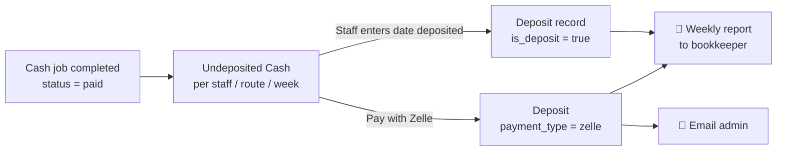
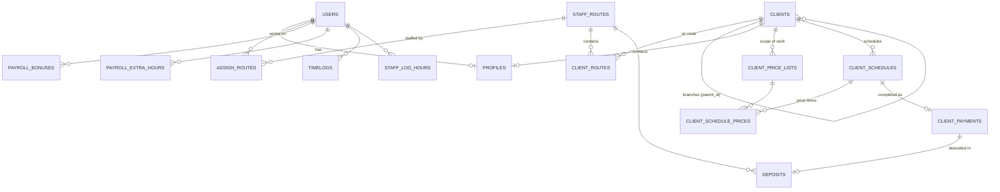

<div align="center">

# 🪟 Paul's Window Cleaning

### Operations Platform & Company Website

**Clients · Routes · Schedules · Payments · Deposits · Payroll · Invoicing · CMS**

[](https://laravel.com/docs/10.x)
[](https://www.php.net/)
[](#-database)
[](https://getbootstrap.com/)
[](#-quickbooks-online)

[paulswindowcleaning.org](https://paulswindowcleaning.org)

</div>

---

> [!CAUTION]
> **Read [⚠️ Critical: the patched vendor file](#️-critical-the-patched-vendor-file) before you run `composer` anywhere.**
> Running `composer install` or `composer update` breaks every relationship in the app, and the admin dashboard crashes.

---

## 📑 Table of Contents

- [Overview](#-overview)
- [Tech Stack](#-tech-stack)
- [Features](#-features)
- [User Roles](#-user-roles)
- [Project Structure](#-project-structure)
- [Core Business Concepts](#-core-business-concepts)
  - [The 13-Cycle Calendar](#-the-13-cycle-calendar)
  - [Service Frequencies & Schedules](#-service-frequencies--schedules)
  - [Job Completion & Payments](#-job-completion--payments)
  - [Cash Deposits](#-cash-deposits)
  - [Payroll](#-payroll)
- [Database](#-database)
- [Local Setup (WAMP)](#-local-setup-wamp)
- [⚠️ Critical: the patched vendor file](#️-critical-the-patched-vendor-file)
- [Environment Variables](#-environment-variables)
- [Integrations](#-integrations)
- [Scheduled / Automated Tasks](#-scheduled--automated-tasks)
- [Deployment](#-deployment)
- [Useful Commands](#-useful-commands)
- [Route Map](#-route-map)
- [Known Issues & Tech Debt](#-known-issues--tech-debt)
- [Development Conventions](#-development-conventions)

---

## 🧭 Overview

This is the software behind **Paul's Window Cleaning**, a commercial and residential window-cleaning business. One Laravel application does two jobs:

| Part | Who uses it | What it does |
|---|---|---|
| **Public website** | Customers & visitors | Home, About, Services, Blogs, Contact / quote request, testimonials. Content is edited from the admin CMS. |
| **Operations dashboard** | Admin (Paul) and staff | Manage clients and their branches, build recurring cleaning schedules, run routes, record completed jobs and payments, track cash deposits, run payroll, send QuickBooks invoices and pull reports. |

---

## 🧰 Tech Stack

| Layer | Technology |
|---|---|
| **Framework** | Laravel 10 (live runs **10.17.1**) |
| **Language** | PHP **8.2** |
| **Database** | MySQL / MariaDB, all primary keys are **UUID `char(36)`** |
| **Auth & roles** | `laravel/ui` auth scaffolding + `spatie/laravel-permission` v5 |
| **Views** | Blade, Bootstrap 5, jQuery, `laravelcollective/html` |
| **PDF** | `barryvdh/laravel-dompdf` |
| **Excel** | `phpoffice/phpspreadsheet` |
| **Accounting** | QuickBooks Online (`quickbooks/v3-php-sdk`, `clevpro/laravel-quickbooks`) |
| **Other packages** | `stripe/stripe-php`, `predis/predis`, `laravel/sanctum` |
| **Hosting** | cPanel shared hosting (Apache / LiteSpeed, `ea-php82`) |
| **Local dev** | WampServer on Windows |

---

## ✨ Features

<table>
<tr>
<td width="50%" valign="top">

### 👥 Clients
- Parent clients with **branches** (child locations)
- Cash or invoice billing per client
- Contacts, extra emails/phones, invoice emails
- Price list ("scope of work") per client
- Closed days, best service times, photos
- Route assignment
- Staff can add **potential accounts**, which the admin approves
- Export clients to Excel
- Sync customers to QuickBooks

### 🗓️ Scheduling
- Frequencies: weekly-note based, monthly, bi-monthly, 8-weekly, quarterly, annually
- Up to 6 notes per week slot, each with its own interval (4–52 weeks)
- Extra-work items per note
- Bulk move, move entire calendar, permanent move, monthly date change
- Drag-and-drop client order per route (separate order for admin and staff)
- Priority jobs appear in **Coming Soon** on the dashboard

### 🚚 Routes
- Routes assigned to one or more staff
- Route page by cycle and week with job status
- Excel schedule export and route PDF
- Staff timers and manual hour logging

</td>
<td width="50%" valign="top">

### 💵 Payments & Invoicing
- Mark a job **completed / no payment / omit**
- Partial payments and extra-work charges
- Cash form and invoice form
- 30-day edit window after submission; admin is emailed when a payment is edited
- Create and email **QuickBooks invoices**
- Unpaid accounts report

### 🏦 Cash Deposits
- Undeposited cash per staff and route
- Staff enter the date deposited
- **Zelle** option (emails the admin)
- Manual deposits checked against expected cash
- Weekly deposit report emailed to the bookkeeper

### 🧾 Payroll
- Semi-monthly periods (1st–15th, 16th–end of month)
- Commission-based pay per completed job
- Bonuses and admin-entered extra hours
- Payroll summary emailed to the accountant

### 📊 Reports & 🌐 CMS
- Route report (sales, cash, hours, billed, unpaid) with Excel export
- Route report review toggle
- Completed jobs history
- CMS for Home, About, Services, Contact and Blogs
- Testimonials moderation, contact/quote inbox
- In-app notifications

</td>
</tr>
</table>

---

## 🔐 User Roles

Roles use **Spatie Permission**. The sidebar (`pwc_main_files/resources/views/theme/layout/sidebar.blade.php`) shows a different menu for each role.

| Role | Access |
|---|---|
| 👑 **admin** | Everything operational: staff, clients, routes, schedules, completed jobs, invoices, deposits, payroll, reports, CMS, testimonials, contacts |
| 🧑‍🔧 **staff** | Their assigned routes, potential clients they created, their deposits, payroll, unpaid accounts and route reports |

> [!NOTE]
> Most controllers only check that the user is logged in (`auth`). Role checks are done inside the code (`hasRole('admin')` / `hasRole('staff')`) or only by hiding menu items. See [Known Issues](#-known-issues--tech-debt).

---

## 🗂️ Project Structure

The **web root is the repository root**. The Laravel app lives in the `pwc_main_files/` subfolder, and the root `index.php` boots it and sets the root folder as `public_path()`.

```text
paulswindowcleaning.org/                 ← web root (public_html)
├── index.php                            ← front controller → boots pwc_main_files/
├── .htaccess                            ← local rewrite rules
├── .htaccess-live                       ← production rewrite rules + cPanel PHP 8.2 handler
├── AdminDashboard/  dashboard/  build/  ← static admin theme assets (CSS/JS/images)
├── website/                             ← public website assets + CMS uploads ("website" disk)
├── uploads/  storagez/                  ← uploaded files
│
└── pwc_main_files/                      ← Laravel application
    ├── app/
    │   ├── Concerns/ResolvesDepositDateRange.php
    │   ├── Console/Commands/            ← deposits:send-weekly-report, schedules:cleanup-non-recurring
    │   ├── Http/Controllers/            ← see "Main controllers" below
    │   ├── Http/Middleware/             ← SetTimezone, PreventBackHistory, …
    │   ├── Mail/                        ← WeeklyDepositReportMail, WeeklyPayrollMail, ZelleDepositMail
    │   ├── Models/                      ← Eloquent models (UUID keys)
    │   ├── Services/QuickBooksService.php
    │   └── Support/PayrollPeriod.php
    ├── config/quickbooks.php
    ├── database/migrations/             ← partial history, cannot rebuild the DB from scratch
    ├── resources/views/
    │   ├── dashboard/                   ← admin & staff dashboard screens
    │   ├── clients/  staffmembers/  staffroutes/  complete-jobs/
    │   ├── website/                     ← public site pages
    │   ├── emails/                      ← mail templates
    │   └── theme/layout/                ← master, sidebar, navbar
    ├── routes/web.php                   ← all web routes
    └── vendor/                          ← ⚠️ contains a patched Laravel file (see below)
```

### Main controllers

| Controller | Responsibility |
|---|---|
| `WebsiteController` | Public pages, admin dashboard, client schedule builder & save, cash/invoice payment forms, route report + Excel export, CMS saves, contact/quote form, notifications, weekly report / reminder triggers |
| `ClientsController` | Client & branch CRUD, status toggle, Excel export, email/phone checks, QuickBooks customer sync |
| `ClientSchedulesController` | Schedule notes, bulk move, move entire calendar, permanent move, monthly date updates |
| `StaffRoutesController` | Route list, route detail page (cycle/week view), schedule export |
| `StaffMembersController` | Staff CRUD (user + profile + role), status toggle |
| `DepositsController` | Undeposited cash, deposits, mark deposited, Zelle, route deposit detail |
| `PayrollController` | Payroll periods, bonuses, extra hours, email to accountant |
| `ReportController` | Unpaid accounts report, mark payment paid |
| `InvoiceController` | Invoice lists, QuickBooks invoice creation, QuickBooks webhook |
| `QuickBooksController` | OAuth connect/callback, customer list & import |
| `TimelogController` / `StaffLogHoursController` | Staff timers and manual hour logs |
| `Cms*Controller`, `Testimonials`, `Contacts*` | Website content and inbox |

---

## 🧠 Core Business Concepts

### 📅 The 13-Cycle Calendar

The business doesn't schedule by calendar month. The year is split into **13 four-week cycles**, starting on the **first Monday of January**. Each cycle has **4 weeks**, stored as `week0`–`week3` and shown as Week 1–4.

| # | Cycle name (`week_month`) | Starts |
|:-:|---|---|
| 1 | January - February | first Monday of Jan |
| 2 | February - March | + 4 weeks |
| 3 | March | + 8 weeks |
| 4 | March - April | + 12 weeks |
| 5 | April - May | + 16 weeks |
| 6 | May - June | + 20 weeks |
| 7 | June - July | + 24 weeks |
| 8 | July - August | + 28 weeks |
| 9 | August - September | + 32 weeks |
| 10 | September - October | + 36 weeks |
| 11 | October - November | + 40 weeks |
| 12 | November - December | + 44 weeks |
| 13 | December - January | + 48 weeks |

> [!IMPORTANT]
> This cycle map is copied into several controllers. If you change it, change **every** copy: search for `"January - February"`.

### 🔁 Service Frequencies & Schedules

Each client has a `service_frequency`. Saving the schedule (`WebsiteController::clientScheduleSave`) generates one `client_schedules` row per job occurrence.

| Frequency | How rows are generated |
|---|---|
| `normalWeek` | Each week slot holds **notes** with their own start date and interval (`4_weeks` … `52_weeks`). Rows are generated about 3 years ahead and placed on the matching cycle week. Note 1 uses the selected price items; notes 2+ store **extra work** as JSON. |
| `monthly` / `biMonthly` | Monthly rows from `start_date` (and `second_start_date` for bi-monthly) |
| `eightWeek` / `quarterly` | Every 8 or 12 weeks |
| `annually` | Yearly rows |

**Key tables:** `client_schedules` (one row per occurrence), `client_schedule_prices` (links a row to `client_price_lists` items).

> [!WARNING]
> Saving a schedule **deletes rows that are no longer generated, including completed ones**. Be careful when changing a client's frequency or start dates.

### ✅ Job Completion & Payments

When staff finish a job they submit the **cash** or **invoice** form. This creates a `client_payments` row (one per schedule) and marks the schedule `completed`.

| Field | Meaning |
|---|---|
| `payment_type` | `cash` or `invoice` |
| `option` | `completed`, `no_payment` or `omit` |
| `option_five = partially` + `price_charge_one` | Partial job, charged a custom amount |
| `price_charge_two` + `scope` | Extra work done on site |
| `status` | Cash collection status (`paid` / `pending`) |
| `payment_status` | Invoice / deposit status |
| `submitted_at` (on schedule) | Starts the **30-day edit window** |

The job amount is calculated by `ClientSchedule::calculateMergedInvoiceAmount()`. It combines every schedule row for the same **client + start date**: price items (or the partial price), plus extra work, plus on-site extras.

### 🏦 Cash Deposits



### 💰 Payroll

Handled by `PayrollController` and `App\Support\PayrollPeriod`.

- **Periods:** 1st–15th and 16th–end of month (key format `YYYY-MM-1` / `YYYY-MM-2`)
- **Who:** staff whose profile `employment_type` is `employee`
- **Pay** = Σ (job `final_price` × client `commission_percentage` %) **+** bonuses **+** admin-entered extra hours (`per_hour_amount × total_extra_hours`)
- The summary can be emailed to `ACCOUNTANT_EMAIL`

---

## 🗄️ Database

- **All primary keys are UUID strings (`char(36)`)**, and so are the foreign keys (`client_id`, `staff_id`, `route_id`, …).
- Dates such as `clients.start_date` are stored as **`d/m/Y` strings**, and schedule dates as `Y-m-d` strings.
- The migrations in `pwc_main_files/database/migrations` are **incomplete**. Always start from a **database dump of live**; don't use `php artisan migrate:fresh`.



---

## 💻 Local Setup (WAMP)

### Requirements

- WampServer 3.3+ with **PHP 8.2** selected (WAMP tray → PHP → Version → 8.2.x)
- MySQL or MariaDB
- PHP extensions: `pdo_mysql`, `mbstring`, `gd`, `zip`, `xml`, `curl`, `intl`

### Steps

**1. Get the code** into `C:\wamp64\www\paulswindowcleaning.org`.

**2. Get `pwc_main_files/vendor/` from live**, not from Composer:

```text
Download  /pwc_main_files/vendor/   from the live server (FTP)
```

> [!CAUTION]
> Don't run `composer install` or `composer update`. See [the patched vendor file](#️-critical-the-patched-vendor-file).

**3. Create the environment file**

```bash
cd pwc_main_files
copy .env.example .env
```

Fill in `APP_KEY`, the database credentials, mail settings and the [variables below](#-environment-variables). Use the same `APP_KEY` as live, or anything encrypted with it (sessions, encrypted values) won't decrypt.

**4. Import the database.** Export from live phpMyAdmin, then import locally. If the import fails on strict SQL mode, run `SET GLOBAL sql_mode = '';` first.

**5. Clear the caches** (still inside `pwc_main_files/`)

```bash
php artisan optimize:clear
```

**6. Open the app**

```text
http://localhost/paulswindowcleaning.org/index.php/login
```

---

## ⚠️ Critical: the patched vendor file

The database uses **UUID** primary keys, but the app's models **don't declare it**. Instead, Laravel's own base model was **edited in place** on the server:

`pwc_main_files/vendor/laravel/framework/src/Illuminate/Database/Eloquent/Model.php`

```diff
-    protected $keyType = 'int';
+    protected $keyType = 'string';

-    public $incrementing = true;
+    public $incrementing = false;
```

**If this edit is lost** (any `composer install` or `composer update` restores the original file), Laravel converts UUIDs to integers when it loads relationships. Queries become `where id in (0)`, and you get:

- 💥 `Call to a member function first() on null` on the dashboard
- Blank client and route names in **Coming Soon**
- *"There no Completed Routes Available"* with empty route cards
- Missing staff, routes and clients across the app

**How to recover:** copy `pwc_main_files/vendor/` from live again, or re-apply the two lines above, then run `php artisan optimize:clear`.

> [!TIP]
> **Permanent fix (recommended when you can deploy it):** add `protected $keyType = 'string';` and `public $incrementing = false;` to the app models, or to a shared base model, so the app no longer depends on an edited vendor file.

---

## 🔑 Environment Variables

Besides the standard Laravel keys (`APP_*`, `DB_*`, `MAIL_*`), the app reads:

| Variable | Used for |
|---|---|
| `QUICKBOOKS_CLIENT_ID` | QuickBooks OAuth app ID |
| `QUICKBOOKS_CLIENT_SECRET` | QuickBooks OAuth secret |
| `QUICKBOOKS_REDIRECT_URI` | OAuth callback → `/quickbooks/callback` |
| `QUICKBOOKS_ENVIRONMENT` | `production` or sandbox (OAuth controller) |
| `QUICKBOOKS_SANDBOX` | `true` / `false` (service & config) |
| `QUICKBOOKS_COMPANY_ID` | Realm / company ID (fallback) |
| `QUICKBOOKS_ACCESS_TOKEN` / `QUICKBOOKS_REFRESH_TOKEN` | Fallback tokens; the active tokens are kept in the `quickbooks_tokens` table |
| `QUICKBOOKS_WEBHOOK_TOKEN` | Verifies QuickBooks webhook signatures |
| `BOOKKEEPER_EMAIL` | Recipient of the weekly deposit report |
| `ACCOUNTANT_EMAIL` | Recipient of payroll emails |

> [!NOTE]
> The site timezone is stored in the **settings** table (`timezone`) and read by the `SetTimezone` middleware. The business runs on **America/Chicago** time. The weekly deposit report uses Chicago time explicitly.

---

## 🔌 Integrations

### 🟢 QuickBooks Online

| Flow | Where |
|---|---|
| Connect account (OAuth 2) | `/quickbooks/connect` → `/quickbooks/callback` (`QuickBooksController`) |
| Token storage & refresh | `quickbooks_tokens` table, refreshed by `App\Services\QuickBooksService` |
| Customer sync on client create/update/delete | `ClientsController` |
| Import customers | `/quickbooks/import` |
| Create & email invoice | `POST /create-quickbooks-invoice` (`InvoiceController`) |
| Payment webhook | `POST /quickbooks/webhook` |

### 📧 Email

| Email | Trigger |
|---|---|
| New staff account credentials | Staff member created or updated |
| Contact / quote request | Website contact form |
| Payment edited after submission | `update_payment` |
| Zelle deposit | Staff chooses **Pay with Zelle** |
| Weekly deposit report | `deposits:send-weekly-report` |
| Payroll summary | Payroll → Email |

### 📄 PDF & Excel

- **PDF** (Dompdf): route details PDF (`/route-details-pdf`)
- **Excel, server-side** (PhpSpreadsheet): route report export (`/route_report_export`)
- **Excel, in the browser**: client export and route schedule export. The server returns JSON and the page builds the spreadsheet.

---

## ⏰ Scheduled / Automated Tasks

`pwc_main_files/app/Console/Kernel.php` has **no scheduled commands**. Automation runs through **URLs called by a cron job** on the host:

| URL | Does | Notes |
|---|---|---|
| `GET /send-weekly-deposit-report` | Runs `deposits:send-weekly-report` | Only sends on **Sunday** (America/Chicago), once per 20 hours |
| `GET /send-notifications` | Reminder notifications for jobs 20 days ahead | For 8/12/24-week notes |

Artisan commands (run from `pwc_main_files/`):

```bash
php artisan deposits:send-weekly-report       # email this week's deposits (Mon–Sat) to the bookkeeper
php artisan schedules:cleanup-non-recurring   # ⚠️ deletes schedules past non-recurring limits
```

Example cPanel cron:

```bash
0 8 * * 0  curl -s https://paulswindowcleaning.org/send-weekly-deposit-report > /dev/null
0 7 * * *  curl -s https://paulswindowcleaning.org/send-notifications > /dev/null
```

---

## 🚀 Deployment

Production is **cPanel shared hosting**, deployed by **FTP / SFTP** (for example, PhpStorm Deployment).

1. Upload **only the files you changed** under `pwc_main_files/` (and root assets if needed).
2. **Never upload `vendor/` from a machine where Composer has run.** It overwrites the patched `Model.php`.
3. **Never run `composer` on the server.**
4. After uploading config or route changes, clear caches through SSH (`php artisan optimize:clear`) or the `/clear-all` route.
5. Production uses `.htaccess-live` (it sets the `ea-php82` handler).
6. Production `.env` must have `APP_ENV=production` and `APP_DEBUG=false`.

### ✅ Pre-deploy checklist

- [ ] Tested locally against a recent live DB dump
- [ ] No `dd()`, `dump()` or debug routes left in the code
- [ ] No changes inside `vendor/`
- [ ] Views and routes cleared after upload
- [ ] Checked as both **admin** and **staff**

---

## 🧪 Useful Commands

Run these from inside `pwc_main_files/`:

```bash
php artisan optimize:clear          # clear config, route, view and app caches
php artisan route:list              # list all routes
php artisan tinker                  # REPL against the app
php artisan view:clear              # clear compiled Blade views only
```

---

## 🗺️ Route Map

<details>
<summary><b>🌐 Public website</b></summary>

| Method | URI | Action |
|---|---|---|
| GET | `/` | Home |
| GET | `/about_us` | About |
| GET | `/services` | Services |
| GET | `/blogs/{id?}` | Blog list / detail |
| GET | `/contact_us` | Contact & quote form |
| POST | `/save_contact_us` | Submit quote request |
| POST | `/save_testimonial` | Submit testimonial |
| GET/POST | `/login`, `/logout` | Authentication |

</details>

<details>
<summary><b>📊 Dashboard & clients</b></summary>

| Method | URI | Action |
|---|---|---|
| GET | `/dashboard_index` | Main dashboard |
| RESOURCE | `/clients` | Client CRUD |
| GET/POST | `/branch/{parent_id}/create`, `/branch/{parent_id}/store` | Add branch |
| GET/PUT | `/branch/{id}/edit`, `/branch/{id}/update` | Edit branch |
| GET | `/export-clients` | Excel export |
| GET | `/client-schedule/{id}` | Schedule builder |
| POST | `/client_schedule_save/{id}` | Generate schedules |
| GET | `/client_cash/{id}`, `/client_invoice/{id}` | Job completion forms |
| POST | `/save_payment`, `/update_payment` | Save / edit payment |
| GET | `/complete-jobs` | Completed jobs |

</details>

<details>
<summary><b>🚚 Routes, staff & schedules</b></summary>

| Method | URI | Action |
|---|---|---|
| RESOURCE | `/staffroutes` | Routes |
| GET | `/staffroute/{id}/export-schedule` | Route schedule export |
| RESOURCE | `/staffmembers` | Staff |
| RESOURCE | `/assignroutes` | Staff ↔ route |
| POST | `/clientschedule/bulk-move` | Bulk move jobs |
| POST | `/clientschedule/move-entire-calendar` | Shift a whole route |
| POST | `/clientschedule/selective-permanent-move` | Permanent move |
| POST | `/clientschedule/update-monthly-date` | Monthly date change |
| POST | `/timelogs/start`, `/timelogs/stop` | Staff timers |
| GET/POST | `/staff-log-hours` | Manual hours |

</details>

<details>
<summary><b>💵 Money & reports</b></summary>

| Method | URI | Action |
|---|---|---|
| RESOURCE | `/deposits` | Deposits / undeposited cash |
| POST | `/deposits/mark-deposited` | Mark payments deposited |
| GET | `/deposits/route/{routeId}` | Route deposit detail |
| GET | `/payroll`, `/payroll/{id}` | Payroll |
| POST | `/payroll/{id}/bonus`, `/payroll/{id}/extra-hours`, `/payroll/{id}/email` | Payroll actions |
| GET | `/reports/unpaid-accounts` | Unpaid accounts |
| GET | `/route_report`, `/route_report_export` | Route report & Excel |
| GET | `/invoices` | Invoices |
| POST | `/create-quickbooks-invoice` | Send QuickBooks invoice |

</details>

<details>
<summary><b>⚙️ CMS & integrations</b></summary>

| Method | URI | Action |
|---|---|---|
| GET | `/cms` | Website CMS |
| POST | `/cms_home`, `/cms_about`, `/cms_service`, `/cms_contact`, `/cms_blog` | Save CMS sections |
| RESOURCE | `/testimonials`, `/contacts` | Testimonials, quote inbox |
| GET | `/quickbooks/connect`, `/quickbooks/import` | QuickBooks |
| POST | `/quickbooks/webhook` | QuickBooks webhook |

</details>

---

## 🐞 Known Issues & Tech Debt

A code review in **September 2026** found the items below. Fix them one at a time, and test each against a live DB dump.

**🔒 Security**
- Several routes are **outside the `auth` middleware**: CMS saves, QuickBooks routes, log viewer and cache-clear routes, some schedule-move and status endpoints.
- `pwc_main_files/` sits inside the web root, so `.env`, logs and helper scripts can be reached over HTTP unless the server blocks them. Add a deny rule.
- Public registration (`Auth::routes()`) is enabled.
- File uploads aren't validated by type.
- Role checks are missing on several staff-reachable actions: route pages, payroll, staff edits.
- Helper scripts `runner.php` and `test_dashboard.php` should be removed. **`runner.php` drops and recreates `payroll_bonuses`.**

**🧮 Data & logic**
- Saving a schedule can delete completed jobs and orphan their payments and deposits.
- `biAnnually` has no generation branch.
- The undeposited-cash total can include rows that were already deposited.
- Timezone middleware only changes config, so `now()` stays in the server timezone.
- 53-week years leave a gap week in the 13-cycle calendar.
- Price calculation (`getMultiPriceWithExtra`) is duplicated with small differences across controllers.

**🧹 Cleanup**
- Dead files in `app/Http/Controllers`: `Untitled-1.php`, `RoleController_old.php`, `RoleController_new.php`.
- Migrations don't match the real schema.
- Heavy queries (`::all()`, N+1) on reports and the dashboard.

---

## 📐 Development Conventions

- **UUIDs everywhere:** never assume integer IDs; compare IDs as strings.
- **Business dates:** use the 13-cycle calendar (`week0`–`week3` + cycle name + year), not calendar months.
- **Role checks:** use `auth()->user()->hasRole('admin' | 'staff')` in controllers, not only in Blade.
- **Money:** round to 2 decimals before comparing or saving.
- **Null safety in Blade:** use `?->` for relationships (`$schedule->clientName?->name`).
- **Don't touch `vendor/`**, except the documented `Model.php` patch.
- **Test as admin and as staff** before deploying.

---

<div align="center">

**Paul's Window Cleaning** · Internal operations platform

</div>
